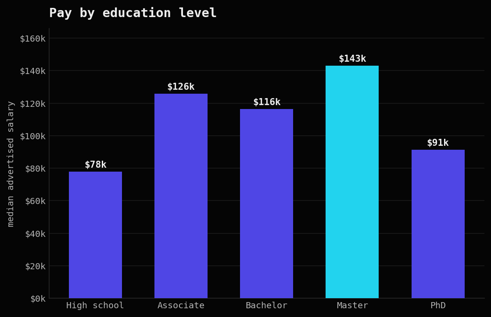

::: {.hero}
::: {.hero__glow}
:::
::: {.wrap}
Boston University · AD688 Applied Business Analytics

# [Simon Hamra.]{.reveal .d1} [A course portfolio]{.reveal .d2} [in labor data.]{.accent .reveal .d2}

::: {.hero__thesis .reveal .d3}
This site collects the three projects I built for my graduate analytics course at Boston University. All three run on the same large Lightcast job posting data: I clean and chart a 700 MB file in PySpark, model it as a small warehouse in Spark SQL, and train machine learning models to predict pay. It is coursework, but the numbers are real and I kept the hard parts in.
:::

::: {.btn-row .reveal .d4}
[See my projects](projects.qmd){.btn .btn--brand}
[Download CV](assets/cv/Simon-Hamra-CV.pdf){.btn .btn--ghost}
[Email me](mailto:simhamra@gmail.com){.btn .btn--link}
:::

::: {.hero__viz .reveal .d5}

<figcaption>From the visualization project (Assignment 3): median advertised salary by occupation across the Lightcast postings, using real observed pay only. The engineering-heavy roles sit at the top.</figcaption>
:::
:::
:::

::: {.section .section--tight}
::: {.wrap}
::: {.chips}
::: {.chip}
**700 MB** read and cleaned in Spark
:::
::: {.chip}
**72,498** job postings analyzed
:::
::: {.chip}
**3 models** compared on real salaries
:::
::: {.chip}
**57%** of pay driven by experience
:::
:::
:::
:::

::: {.section}
::: {.wrap}
::: {.section__head}
Course work

## Three assignments, one dataset, real numbers
These are the three graded projects from my AD688 analytics course, each on the same Lightcast job postings data. Every one shows a different skill, and I kept the heavy work in Spark and only pulled small tables out to draw the charts.
:::

::: {.bento}

<a class="pcard__link" href="projects.qmd#a03">Salary insights at scale</a>

Assignment 3 · PySpark · Visualization
<h3>Salary insights at scale</h3>

I loaded a 700 MB file in Spark, cleaned the messy salary and education fields, filled the gaps in a careful way, and built charts that explain pay across industry, education and remote work.

PySparkpandasPlotlySeaborn

72,498 postingsRead case study →

<a class="pcard__link" href="projects.qmd#a05">Predicting salary, and a trap</a>

Assignment 5 · Machine learning
<h3>Predicting salary, and a trap</h3>

Linear, polynomial and random forest models. Spark refused to give me standard errors, so I had to find out why.

Spark MLRandom forest

+$8k / year of experience→

<a class="pcard__link" href="projects.qmd#a02">A job market in SQL</a>

Assignment 2 · Spark SQL · Data modeling
<h3>A job market in SQL</h3>

I broke one flat file into clean relational tables for companies, industries and locations, then answered four real questions about pay, remote work, and how hiring moves over the year.

Spark SQLStar schemaJoinsmatplotlib

1 star schema, 4 queriesRead case study →

:::
:::
:::

::: {.section .section--tight}
::: {.wrap}
::: {.bento}
::: {.card .col-4}
A short word

### From marketing to machine learning
I started in business and marketing in France, then did two internships in e-commerce and social media. Along the way I found that I like the data part the most. Now I study applied business analytics at Boston University and I am teaching myself machine learning on top of the course.

[More about me](about.qmd){.btn--link}
:::
::: {.card .col-2}
Get in touch

### Open to ML roles
I am looking for a real first experience in machine learning or data. The fastest way to reach me is email.

[simhamra@gmail.com](mailto:simhamra@gmail.com){.btn--link}
:::
:::
:::
:::
