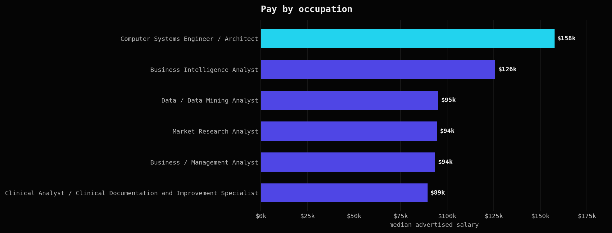
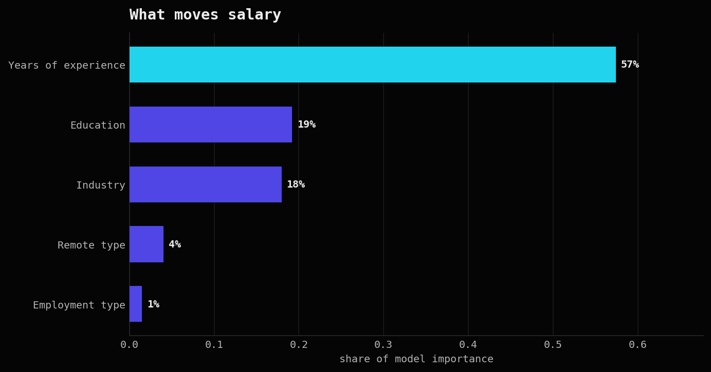
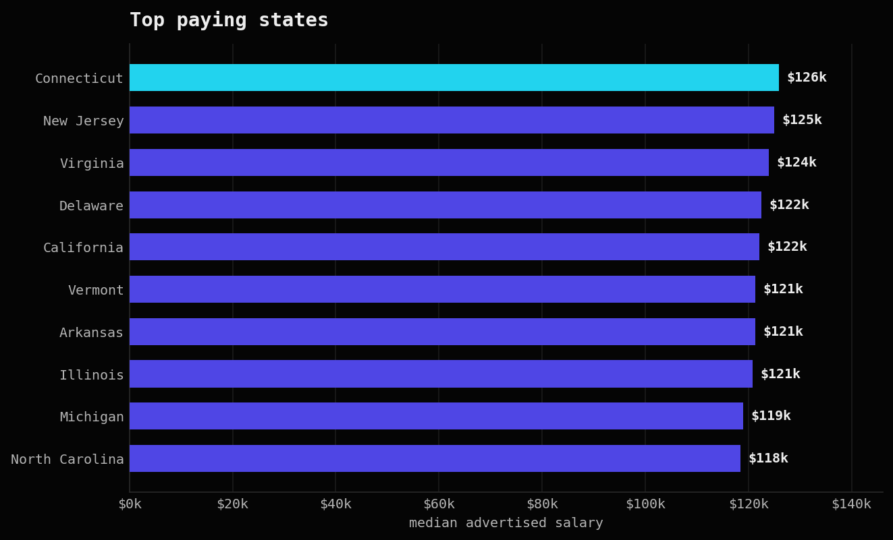

::: {.page-intro}
::: {.wrap}
Projects

# Three case studies.

::: {.lead}
All three use the same Lightcast job posting data from my Boston University course. Each one shows a different skill: cleaning and charting big data, building machine learning models, and modeling data in SQL. I kept the honest numbers, including the parts that were hard.
:::
:::
:::

::: {.section}
::: {.wrap}

<!-- ================= A03 ================= -->
::: {#a03 .case}
::: {.case__grid}
::: {.case__text}
Project 01 · PySpark · Visualization

## Salary insights at scale

I took a 700 MB Lightcast file, cleaned it in Spark, and turned it into clear pictures of who gets paid what.

<dl class="dl">

<dt>Problem</dt><dd>The file holds tens of thousands of job postings, but it is messy. Salary, experience and education all load as text, and most rows do not even list a salary. I needed clean, honest numbers I could chart.</dd>

<dt>Constraints</dt><dd>The raw file is close to <strong>700 MB</strong>, too big to open in pandas on a laptop. So all the heavy work, loading, casting, medians and grouping, had to stay in Spark. I only pulled small tables out at the end.</dd>

<dt>Approach</dt><dd>I cast the salary and experience columns to numbers, computed medians in Spark, and filled missing salaries with a careful midpoint rule. I kept a copy of the real observed salary, so when I report a true median I never use a filled value. Then I drew the charts with Plotly and Seaborn on a custom theme.</dd>

<dt>Tradeoff</dt><dd>I had to choose between dropping rows with no salary or filling them. Dropping throws away most of the data. Filling keeps it, but it can hide the truth. My answer was to do both: fill for completeness, but always use the observed salary for any real median.</dd>

<dt>Result</dt><dd><strong>72,498 postings</strong> cleaned and charted. Full time roles pay more, remote and hybrid roles lean higher, and the best paid occupation reaches about <strong>$158k</strong> while the most common roles sit near $95k to $126k.</dd>

</dl>

PySparkpandasPlotlySeabornQuarto

::: {.btn-row}
[Code on GitHub](https://github.com/simonhamra){.btn .btn--ghost}
:::
:::
::: {.case__fig}

<figcaption>Median advertised salary by occupation, using real observed pay only. The engineering heavy roles sit at the top.</figcaption>
:::
:::
:::

<!-- ================= A05 ================= -->
::: {#a05 .case}
::: {.case__grid}
::: {.case__text}
Project 02 · Machine learning

## Predicting salary, and a trap

I trained three models to predict salary, and hit a classic trap that stops a model from giving any statistics.

<dl class="dl">

<dt>Problem</dt><dd>I wanted to predict salary from experience, education and how the role is delivered, and also explain which feature matters most.</dd>

<dt>Constraints</dt><dd>After I required a real salary plus every feature present, only about <strong>2,000 rows</strong> were left out of the 30,000 that had a salary. Small, but every value is real and nothing is filled in.</dd>

<dt>Approach</dt><dd>I built a Spark ML pipeline with indexing, one hot encoding and a feature vector, then fit a linear model, a polynomial model, and a random forest with 200 trees and depth 8. I split the data 80 / 20 with a fixed seed.</dd>

<dt>The trap</dt><dd>Spark gave me coefficients but refused the standard errors, so no p values and no confidence intervals. The reason was <strong>multicollinearity</strong>. The minimum and maximum experience columns were identical in every row, their correlation was exactly <strong>1.0</strong>. I dropped one column and the statistics came back.</dd>

<dt>Result</dt><dd>Each extra year of experience is worth about <strong>$8,000</strong>, and that effect is strong. The random forest was the most accurate model, but the linear model explains the story best. On the data, experience carries about <strong>57%</strong> of the importance, far ahead of education and industry.</dd>

</dl>

Spark MLRandom forestGLRscikit-learnStats

::: {.btn-row}
[Code on GitHub](https://github.com/simonhamra){.btn .btn--ghost}
:::
:::
::: {.case__fig}

<figcaption>A random forest on the Lightcast features. Years of experience is by far the strongest driver of salary.</figcaption>
:::
:::
:::

<!-- ================= A02 ================= -->
::: {#a02 .case}
::: {.case__grid}
::: {.case__text}
Project 03 · Spark SQL · Data modeling

## A job market in SQL

I turned one flat file into a small data warehouse, then answered four real questions in SQL.

<dl class="dl">

<dt>Problem</dt><dd>A single wide table is hard to query and full of repeated values. I wanted clean tables I could join, and a few clear answers about pay and hiring.</dd>

<dt>Constraints</dt><dd>The same large Lightcast file, so I built and queried everything in Spark SQL instead of loading it into memory.</dd>

<dt>Approach</dt><dd>I split the data into dimension tables for companies, industries and locations, each with its own key, and joined them back into one fact table of postings. That is a <strong>star schema</strong>. Then I wrote four queries: median pay by occupation in tech, the top remote employers in California, how California hiring moves month by month, and average pay across major US metros.</dd>

<dt>Tradeoff</dt><dd>I could have kept one flat table and queried it directly, which is faster to set up. I chose the star schema because the joins stay clean, the tables are reusable, and it is closer to how a real data warehouse works.</dd>

<dt>Result</dt><dd><strong>1 star schema, 4 queries.</strong> Pay is highest in expensive metros like San Francisco and Seattle, remote hiring is concentrated in a few large employers, and California hiring dips in summer then recovers near the end of the year.</dd>

</dl>

Spark SQLStar schemaJoinsmatplotlib

::: {.btn-row}
[Code on GitHub](https://github.com/simonhamra){.btn .btn--ghost}
:::
:::
::: {.case__fig}

<figcaption>Median advertised salary by state. The pay gap between the top states and the rest is large.</figcaption>
:::
:::
:::

:::
:::

::: {.section .section--tight}
::: {.wrap}
::: {.contact-card}
Want to see the code?

### The notebooks are on GitHub

Every project was built in a Quarto notebook with PySpark. Happy to walk through any of them.

::: {.btn-row style="justify-content:center"}
[Go to GitHub](https://github.com/simonhamra){.btn .btn--brand}
[Email me](mailto:simhamra@gmail.com){.btn .btn--ghost}
:::
:::
:::
:::
